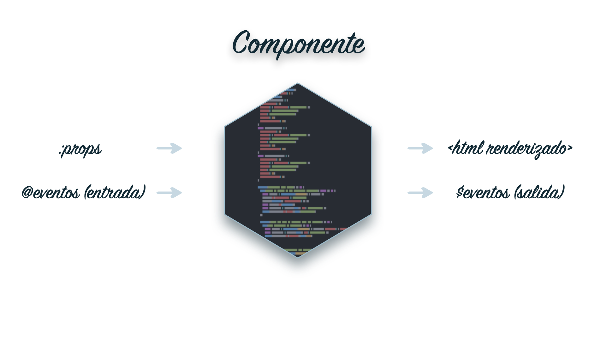
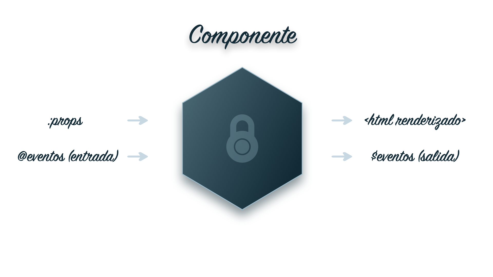

# Estructura y metodología de los tests

> Existen distintas formas de plantear los tests, pero aquí proponemos una de las más extendidas.

## Estructura de los archivos de Test

Si hemos configurado correctamente nuestro entorno de test, [Jest] se encargará de buscar los archivos correspondientes a la hora de lanzar los tests, por lo que es indiferente dónde dejemos estos archivos siempre y cuando estén dentro del scope que declaramos en la [configuración] de [Jest]. Se recomienda guardar los archivos de test junto con el archivo `.vue` del componente al que hacen referencia dentro de un mismo directorio bajo el nombre del componente. De esta forma tendremos los tests y los archivos del componente almacenados en un mismo directorio facilitando compartir nuestro componente y saber si dispone de tests o no.

```fs
  .
  +-- src
      +-- components
      |   +-- component-a
      |   |   +-- ComponentA.vue
      |   |   +-- ComponentA.spec.js
      |   +-- component-b
      |   |   +-- ComponentB.vue
      |   |   +-- ComponentB.spec.js
      |   +-- ...
      +-- ...
```

## Concepto de Componente

Antes de empezar a definir una metodología es necesario entender en profundidad lo que es un componente y qué características comunes comparten todos los componentes que utilizamos dentro de nuestras apps.

> Un componente es una pieza de software que encapsula una determinada funcionalidad.

Estamos acostumbrados a utilizar componentes del Sistema de Diseño y son un buen ejemplo para entender por qué la metodología que planteamos funciona y es aconsejable seguirla. Generalmente cuando utilizamos un componente lo insertamos dentro de nuestro código y utilizamos sus `:props` para configurarlo desde fuera, lo que hace que el componente se comporte como nosotros queremos. Si en algún momento no conseguimos configurarlo correctamente buscamos en la documentación cómo se debe configurar para resolver nuestras dudas y entender cómo responde a las propiedades que utilizamos. El resultado final de insertar y configurar un componente del sistema de diseño en nuestro código es una pieza de `hmtl` dentro de nuestro navegador con la que el usuario puede interactuar o que muestra determinada información.

La documentación del Sistema de Diseño (o de cualquier componente) no es más que una API, una interfaz que nos permite dar órdenes o configurar esta pieza de software. Es una serie de opciones que nos dan los desarrolladores de estos componentes para utilizarlos.

Cuando somos nosotros quienes desarrollamos un componente, nos planteamos qué propiedades debe admitir para que funcione como debe, así como qué eventos debe escuchar para que se pueda interactuar con el. El resultado de estas **propiedades** y estos **eventos** se traduce a través de la lógica que desarrollamos en el **renderizado de un determinado html** o en la **emisión de eventos** para comunicarse con otras partes de nuestra aplicación.



Este conjunto de **entradas** y de **salidas** (que dependen de las entradas) constituye una especie de **contrato** con el desarrollador que va a utilizar este componente, que espera que funcione como debe, siguiendo los detalles de la documentación del componente, y de forma previsible.

En ningún momento el desarrollador que utilice este componente debería verse obligado a entender cómo funciona por dentro. No le interesa de qué forma cumple sus tareas o qué lógica sigue, sólo le interesa que al configurar la **propiedad** *P* el **html renderizado** es *P'* y que al **hacer click en el botón** *B* se emite el evento *B'*.

El componente para el desarrollador que lo utiliza es una **caja negra** con la que puede interactuar a través de su **API** y que va a reaccionar, según la documentación, de forma predecible.



## Concepto de Contrato

Por eso lo importante para garantizar que un componente funciona como debería y como se espera no es la lógica que determina su comportamiento, si no el **contrato** que se establece en la **API**, y es esto lo que se debe probar.

Esto conlleva una serie de ventajas a la hora de probar un componente. La principal ventaja es que si mantenemos el **contrato** establecido podemos modificar la lógica interna como queramos sin comprometer el componente (ya que el test seguirá dando un resultado positivo). Esto nos permite refactorizar el componente sin miedo, ya que si en la refactorización perdemos alguna funcionalidad (incumplimos alguna de las reglas establecidas en el **contrato**) el test nos avisará, y no estaremos rompiendo la aplicación.

La idea es que no sea necesario modificar el test a menos que cambie el contrato.

> Esto no quiere decir que el primer paso a la hora de desarrollar un test no sea entender el código y refactorizarlo para que la lógica sea sencilla, mantenible y predecible. Los tests sobre componentes [sencillos] y bien documentados son infinitamente más fáciles de hacer y mantener.

Además es más fácil definir los tests que debe pasar este componente ya que están muy relacionados con la funcionalidad y lo que esperamos de éste. Lo ideal es escribir las reglas del **contrato** del componente, y una vez presentes desarrollar tests para asegurarnos de que estas reglas se están cumpliendo.

Para comprender mejor esta metodología vamos a utilizar como ejemplo un componente que cumple la funcionalidad de contador. Al pulsar en un botón el contador incrementa su valor.

El componente tiene como propiedades (`props`):
  - `initialValue`: Valor inicial con el que empieza la cuenta

Y como eventos de entrada (`@event`):
  - El evento que emite el botón al ser clickado por un usuario.

> Puede parecer un poco confuso que estando el botón dentro de nuestro componente este evento se considere un evento de entrada, pero podemos pensar que el verdadero evento es la interacción del usuario con el ratón.

```html
<template lang="html">
  <div>
    <p ref="count"> {{ count }} </p>
    <button @click="handleClick" ref="button"> Incrementar valor </button>
  </div>  
</template>

<script>
export default {

  name: "counter",

  props: {
    initialValue: {
      type: Number,
      default: 0,
      validator: value => value >= 0
    },
  },

  data() {
    return {
      count: 0
    }
  },

  mounted () {
    this.count = this.initialValue
  },

  methods: {
    handleClick () {
      this.count++
      this.$emit('count', this.count)
    }
  }

}
</script>
```

En el caso de un componente como este podríamos escribir la siguientes reglas:

- **Cuando** no se pasa un valor inicial al contador a través de la propiedad `initialValue` se **espera** que el valor del contador sea **0**.
- **Cuando** se le pasa un valor inicial al contador a través de la propiedad `initialValue` se **espera** que el valor del contador sea `initialValue`.
- **Cuando** el usuario hace click en el botón, se **espera** que el contador incremente su valor en **1** (y además se mueste este nuevo valor en la pantalla).
- **Cuando** el usuario hace click en el botón, se **espera** que el contador emita un **evento** llamado *count* con el nuevo valor del contador.

Este conjunto de reglas definen la **interfaz** de nuestro componente y es el **contrato** que debemos asegurar en el test.

Podríamos refactorizar el componente y sacar el `this.$emit('count', this.count)` a otro método que se invocaría desde el `handleClick` y al seguirse cumpliendo el contrato el test debería seguir dando un resultado positivo. La **interfaz** del componente no se ve alterada por esta modificación, con lo que no hay motivo para que el test falle, ningún usuario que esté utilizando este componente va a notar este cambio, ya que la funcionalidad se mantiene.

## Estructura de un Test

Una vez tenemos definido el conjunto de reglas que conforman el **contrato** de nuestro componente es muy sencillo organizar el archivo de test acorde a estas reglas. Además la sintaxis de [Jest] ayuda a traducir la regla a un test.

Por ejemplo, para la primera regla que hemos definido, el test podría ser el siguiente:

- **Cuando** no se pasa un valor inicial al contador a través de la propiedad `initialValue` se **espera** que el valor del contador sea **0**.

```js
describe(':initialValue | Cuando no se pasa un valor a initialValue', () => {
  it('El valor del contador es 0', () => {
    ...
    expect(wrapper.vm.counter).toBe(0)
  })
})
```

- `describe` está **describiendo** el caso de uso definido en la regla.
- `it` es el propio componente, quién **inicializa** el valor del contador.
- `expect` es el comportamiento que **se espera** del componente.

> `it` es un alias para `test`. La documentación de [Jest] utiliza `test`, y en la mayoría de los ejemplos veremos que se utiliza `test`, pero para explicar cómo se relaciona la regla con el test `it` resulta más apropiado para entender que es el componente quien se encarga de cumplir la regla.

A la hora de estructurar un test damos una serie de recomendaciones que es conveniente seguir, ya que facilitan la colaboración en los archivos de test y ayudan a que el desarrollador que ve el componente por primera vez pueda entender su funcionamiento leyendo la suite de tests que se han desarrollado para éste.

- **Inicilaizar las variables auxiliares globales en el scope global**

  Se recomienda incluir las variables auxiliares, como ejemplos de las estructuras de datos con las que trabaja el componente (respuesta de una API, por ejemplo) o mocks o `jest.fn()` que se vayan a utilizar en todos los tests, al principio del test en el scope global.

  ```js
  import Vue from 'vue'
  import { shallowMount, createLocalVue } from '@vue/test-utils'
  import NewWorkingCenterModal from './NewWorkingCenterModal'

  const ResponseModel = {
    id: 'JX15DS',
    name: 'Department A',
    weekstart: 'MONDAY',
    timezone: 'Madrid/Europe',
    center: { centerId: 1 },
  }
  const apiMock = jest.fn().mockResolvedValue({ data: [ResponseModel] })
  ...

  ```

- **Utilizar un describe global**

  También se recomienda utilizar un `describe` global que encapsule todos los tests con el nombre `<Component> test suite`.

  ```js
  describe ('NewWorkingCenterModal test suite', () => {
    ... // Todos los tests que componen la suite
  })
  ```

- **Utilizar un describe por cada regla del contrato**

  Además, se recomienda utilizar un `describe` para cada regla de forma ordenada. Generalmente se empieza por probar las reglas en las que la interacción sea la configuración de alguna prop y se dejan los eventos de entrada para el final. También recomendamos utilizar la notación de Vue para distinguir entre `:props` y `@eventos` de forma rápida.

  ```js
  describe ('NewWorkingCenterModal test suite', () => {
    describe(':prop | When prop P is set to...', () => {})
    describe('@event | When event E is triggered...', () => {})
  })
  ```
  Es importante además que los test sean autoexplicativos, y que la regla quede bien reflejada en la definicion del `describe` y del `test`. Ocurre lo mismo con las variables que utilicemos a lo largo del test y en general en todo nuestro código.

  > Se entiende mejor qué función cumple esta línea de código `const animalNames = animals.map(animal => animal.name)` que esta otra `const n = arr.map(a => a.name)`.

### Snippets

Para facilitar el desarrollo de los tests hemos preparado una serie de [snippets](../../snippets) que aceleran el trabajo garantizando además que se cumplen estas recomendaciones.

> Estos snippets sustituyen a los snippets de la versión anterior que no siguen esta metodología.

- **Snippet de esqueleto**

  El snippet de esqueleto se utiliza escribiendo `spec` + <kbd>⇥ Tab</kbd> y genera la siguiente estructura.

  ```js
  import Vue from 'vue'
  import { shallowMount, createLocalVue } from '@vue/test-utils'
  import Component from './Component'

  const localVue = createLocalVue()

  describe('Component test suite', () => {
    // ...
  })
  ```

  > Tras pulsar <kbd>⇥ Tab</kbd> la primera vez el cursor queda en el placeholder de *Component* por lo que podemos escribir el nombre del componente que vamos a probar y tener el archivo completamente configurado. Pulsar <kbd>⇥ Tab</kbd> una segunda vez nos lleva al cuerpo del describe.

- **Snippets de describe**

  Los snippets de describe se utilizan escribiendo `desc | desc-prop | desc-event` + <kbd>⇥ Tab</kbd> y generan las siguientes estructuras respectivamente.

  ```js
  // desc + Tab
  describe('property/event | when', () => {
    // ...
  })

  // desc-prop + Tab
  describe(':prop | when', () => {
    // ...
  })

  // desc-event + Tab
  describe('@event | when', () => {
    // ...
  })
  ```

  > De nuevo, tras pulsar <kbd>⇥ Tab</kbd> por primera vez el cursor se queda en la primera parte del string del describe (antes de la barra `|` ), y un segundo <kbd>⇥ Tab</kbd> en la parte de la condición (después de la barra `|` ). Un tercer <kbd>⇥ Tab</kbd> nos lleva al cuerpo del describe.

- **Snippet de test**

  El snippet de test se utliliza escribiendo `test` + <kbd>⇥ Tab</kbd> y genera la siguiente estructura.

  ```js
  test('behaviour', () => {
    // ...
  })
  ```

  > Aquí el primer <kbd>⇥ Tab</kbd> nos lleva al placeholder *behaviour* y el segundo al cuerpo del test.

## Casos prácticos más comunes

En este apartado detallamos los casos prácticos más comunes que aparecen a la hora de probar nuestros componentes. Los hemos dividido en cuatro apartados, dos para las **entradas** (propiedades y eventos de entrada) y dos para las **salidas** (html renderizado y eventos emitidos).

> Este apartado se irá actualizando según vayamos encontrando más casos prácticos que se puedan aplicar por regla general a nuestros componentes.

Los dos primeros apartados (para las entradas) se centran en la parte del test encargada de setear propiedades, validar que estas propiedades están configuradas correctamente y de provocar eventos de entrada, es decir, la configuración del `shallowMount() o mount()` y la interacción con el `wrapper`.

Los dos últimos apartados (para las salidas) tiene que ver con lo que se espera del componente, es decir, lo que utilizamos dentro del comando `expect()`.

En la mayoría de los casos utilizaremos como ejemplo el componente contador que hemos utilizado en secciones anteriores. Recordemos las reglas que conforman su **contrato**:

1. **Cuando** no se pasa un valor inicial al contador a través de la propiedad `initialValue` se **espera** que el valor del contador sea **0**.
2. **Cuando** se le pasa un valor inicial al contador a través de la propiedad `initialValue` se **espera** que el valor del contador sea `initialValue`.
3. **Cuando** el usuario hace click en el botón, se **espera** que el contador incremente su valor en **1** (y además se mueste este nuevo valor en la pantalla).
4. **Cuando** el usuario hace click en el botón, se **espera** que el contador emita un **evento** llamado *count* con el nuevo valor del contador.

### 1. Props

Existen dos formas de configurar las props de nuestro componente para generar los distintos casos de uso que tiene este. En el caso del contador, que admite la prop `initialValue`, si queremos probar la segunda regla, debemos encontrar la forma de inicializar esta propiedad para probar el comportamiento del componente en este caso.

La primera alternativa es configurar el valor de esta `prop` a la hora de montar el componente a través de la opción `propsData <object>` del método `shallowMount(<Component>, <options>)`:

```js
const sampleInitialValue = 4
describe(`:initialValue | Cuando se pasa ${sampleInitialValue} como valor inicial`, () => {
  it(`El valor del contador es ${sampleInitialValue}`, () => {
    const wrapper = shallowMount(Counter, { propsData: { initialValue: sampleInitialValue } })
    expect(wrapper.vm.counter).toBe(sampleInitialValue)
  })
})
```

Otra alternativa será configurar el valor de esta `prop` una vez está montado el componente utilizando el método `setProps({ <prop>: <value> })` del `wrapper`.
En el caso de nuestro componente, para que este test pasara sería necesario refactorizar el código y utilizar un `watch` para hacer la asignación de `initialValue` al `counter`. Tal y como está actualmente el componente (usando el `mounted`), el valor del `counter` solo se inicializa al montar el componente, por eso en el caso anterior sí funciona. En este, al modificar la propiedad una vez montado el componente (tras el `shallowMount`), el cambio no se verá reflejado.

> Este test podría reaprovecharse para probar que en efecto una vez montado el componente no puede setearse el `counter` cambiando el `.toBe` por `.not.toBe`

```js
const sampleInitialValue = 4
describe(`:initialValue | Cuando se pasa ${sampleInitialValue} como valor inicial`, () => {
  it(`El valor del contador es ${sampleInitialValue}`, () => {
    const wrapper = shallowMount(Counter)
    wrapper.setProps({ initialValue: sampleInitialValue })
    expect(wrapper.vm.count).toBe(sampleInitialValue)
  })
})
```

Además de configurar las props, en muchas ocasiones nos interesa probar que si el **contrato** dice que la `prop` es de tipo `Number` y tiene un valor por defecto de `0`, esto se esté cumpliendo.

Para probar la configuración de una `prop` hay que acceder la propiedad `$options` del componente, donde se guarda toda la configuración de este.

```js
describe(`:initialValue | Configuración de la prop`, () => {
  it(`La prop tiene como valor por defecto 0 y es de tipo Number`, () => {
    const wrapper = shallowMount(Counter)
    const prop = wrapper.vm.$options.props.initialValue
    expect(prop.isRequired).toBeFalsy() // En nuestro caso no es obligatoria
    expect(prop.default).toBe(0) // Tiene 0 como valor por defecto
    expect(prop.type).toBe(Number) // Es de tipo Number
    expect(prop.validator(-10)).toBe(false) // No admite números negativos
  })
})
```

Es importante hacer este tipo de comprobaciones porque son las que defienden al desarrollador de utilizar de forma incorrecta el componente sin darse cuenta. Además son parte del contrato. Si planteamos que la `prop` es obligatoria, en nuestros tests no vamos a probar casos en los que la `prop` no esté definida, porque es obligatoria. Por lo que si alguien quita la propiedad `required` de la configuración de la `prop` por accidente, el test no se dará cuenta, y además hemos perdido el aviso que da Vue cuando no configuras las `props` obligatorias de un componente.

### 2. Eventos de entrada

Existen varias formas de provocar un evento de entrada, y hay que considerar el caso especial en que el evento de entrada llega a través del `EventsBus`. También es importante aquí entender de qué forma gestiona Vue los eventos y cómo es el ciclo de trabajo que gestiona el comportamiento de un componente.


Vue pospone las actualizaciones del renderizado y la emisión de eventos al final de los ciclos del componente de forma asíncrona, de manera que si hacemos un cambio en el componente que implique una actualización del renderizado o que provoque que se emita un evento, tendremos que esperar hasta el ciclo siguiente para poder hacer la comprobación.

> En la documentación de Vue acerca de la [cola de actualización] viene explicado con más detalle este concepto.

Esto es importante a la hora de provocar eventos de entrada, ya que debemos esperar al siguiente ciclo después de haber provocado el evento para hacer nuestras comprobaciones. [Jest] nos permite declarar tests asíncronos donde podemos 'detener' la ejecución del test hasta que se resuelva una promesa, como la que genera el `$nextTick()` de Vue, que nos avisa de que hemos cambiado de ciclo.

Dependiendo de la alternativa que utilicemos para provocar el evento (o simularlo) debemos tener en cuenta si esto es necesario o no.

La primera alternativa, si el evento a provocar es un evento nativo del navegador como puede ser un `click`, es lanzar el método `trigger()` sobre el `wrapper` del elemento que debe emitir ese evento.

```js
describe(`@click | Cuando el usuario hace click en el botón`, () => {
  it('El contador incrementa su valor en 1', () => {
    const wrapper = shallowMount(Counter)
    const count_0 = wrapper.vm.count // Valor del contador en el momento inicial
    const button = wrapper.find({ ref: 'button' }) // Buscamos el botón
    button.trigger('click') // Provocamos el evento
    expect(wrapper.vm.count).toBe(counter_0 + 1) // Comprobamos el resultado
  })
})
```

En este caso, al ser el botón un elemento html nativo, el evento se lanza automáticamente sin estar controlado por el ciclo de vida del Vue, con lo que no hace falta esperar. Si el botón fuera un componente como el `ods-button`, el evento pasaría por este componente y el `$emit()` sería pospuesto hasta el final del ciclo, con lo que se haría necesario esperar.

```js
describe(`@click | Cuando el usuario hace click en el botón`, () => {
  it('El contador incrementa su valor en 1', async () => {
    const wrapper = shallowMount(Counter)
    const count_0 = wrapper.vm.count // Valor del contador en el momento inicial
    const button = wrapper.find({ ref: 'buttonOds' }) // Buscamos el botón
    button.trigger('click') // Provocamos el evento
    await wrapper.vm.$nextTick() // Ahora si es necesario esperar
    expect(wrapper.vm.count).toBe(counter_0 + 1) // Comprobamos el resultado
  })
})
```

Para eventos que no son nativos del navegador, el método `trigger()` no sirve, y debemos simularlo emitiendo desde el propio componente que genera el evento.

Para ello debemos usar el método `$emit()` del componente que emite el evento, y que es quién hará que la llamada al controlador se posponga y sea necesario esperar al siguiente ciclo.

```js
describe(`@click | Cuando el usuario hace click en el botón`, () => {
  it('El contador incrementa su valor en 1', async () => {
    const wrapper = shallowMount(Counter)
    const count_0 = wrapper.vm.count // Valor del contador en el momento inicial
    const button = wrapper.find({ ref: 'buttonOds' }) // Buscamos el botón
    button.vm.$emit('custom-click-event') // Provocamos el evento personalizado
    await wrapper.vm.$nextTick() // Ahora también es necesario esperar
    expect(wrapper.vm.count).toBe(counter_0 + 1) // Comprobamos el resultado
  })
})
```

Si queremos evitar esta espera existe una manera de hacerlo consistente en simular el evento y llamar nosotros desde el test a la función que tiene asignada.

> Esto solo funciona cuando quien emite el evento es un componente de Vue, no cuando es una etiqueta html.

Para ello hay que saber que al asociar un controlador a un evento a través de la sintaxis `@event="handler"` del componente, lo que hace Vue es guardar en el componente hijo, dentro de un objeto `$listeners`, la referencia a ese controlador (de la forma `$listeners: { [event]: handler }`) para poder invocarlo desde dentro del mismo componente.

> El concepto de *emitir un evento* se utiliza para entender mejor la interacción entre componentes y el flujo de los datos, pero en realidad no es el hijo quién pasa datos al padre, si no que es el padre quien le pasa el controlador al hijo para que lo ejecute él.

Este test podría entonces escribirse de la siguiente manera:

```js
describe(`@click | Cuando el usuario hace click en el botón`, () => {
  it('El contador incrementa su valor en 1', () => {
    const wrapper = shallowMount(Counter)
    const count_0 = wrapper.vm.count // Valor del contador en el momento inicial
    const button = wrapper.find({ ref: 'buttonOds' }) // Buscamos el botón
    button.vm.$listeners.click() // Simulamos el evento
    expect(wrapper.vm.count).toBe(counter_0 + 1) // Comprobamos el resultado
  })
})
```

De esta forma no es necesario esperar al siguiente ciclo, ya que estamos invocando la función controlador directamente en vez de a través del `$emit()`, que es quién hace que se posponga la ejecución.

Aunque parezca que nos estamos saltando un paso al invocar directamente el controlador (algo que podríamos hacer a través de `wrapper.vm.handleClick()`), esta forma de probar el componente es mucho más segura que lanzar el método controlador desde el propio componente padre, ya que nos garantiza no sólo que el controlador existe, sino además que está *bindeado* con el componente que debe lanzarlo.

### 3. Hmtl renderizado

Una de las salidas del componente que seguramente necesitemos probar será el renderizado del html que sea el resultado de una combinación determinada de entradas. Las utilidades de [Vue Test Utils] nos permiten probar esta salida de varias formas con más o menos detalle. Un punto importante a tener en cuenta aquí es que el renderizado, al igual que la emisión de eventos, se realiza de forma asíncrona y al final de los ciclos del componente, con lo que en muchos casos sera necesario escribir el test de forma asíncrona.

Un caso de uso sencillo es probar que el valor de una `prop`, o un valor generado a partir del valor de una `prop`, se pinta en un lugar determinado del `html`. Como es el resultado de la configuración de una prop, es aconsejable inlclurlo dentro del `describe` de esa `prop` para ese caso determinado. Para el ejemplo hemos tomado el caso en que se configura el contador con un `initialValue` y hemos utilizado el `describe` que hemos empezado en la sección de props para incluir el test del renderizado. De esta manera además aprovechamos el montado del componente y nos ahorramos algo de tiempo de ejecución.

> En algunos casos puede incluso probarse dentro del mismo test (un `test` puede tener más de un `expect`), pero suele quedar más claro hacerlo en tests separados.

Para comprobar que se renderiza correctamente hacemos uso del método `text()` del `wrapper`, y tras buscar el elemento html donde debía pintarse el valor (buscando el elemento a través de una referencia en este caso), comprobamos que el texto de ese `wrapper` coincide con lo que esperamos. En este caso es necesario pasar el texto renderizado a tipo `Number` ya que el `toBe` hace una prueba de identidad y, aunque la `prop` es de tipo `Number`, el método `text()` devuelve un `String`.

```js
const sampleInitialValue = 4
describe(`:initialValue | Cuando se pasa ${sampleInitialValue} como valor inicial`, () => {

  const wrapper = shallowMount(Counter, { propsData: { initialValue: sampleInitialValue } })

  // ... TEST PROP

  /* TEST RENDER*/
  it('El contador muestra su valor en el html renderizado', () => {
    const p = wrapper.find({ ref: 'count' }) // Buscamos el elemento donde debe pintarse
    expect(Number(p.text())).toBe(sampleInitialValue) // Comprobamos que el texto coincide
  })

})
```

Otra forma de comprobar que se está renderizando correctamente el `html` es mediante el uso de [Snapshots]. Un Snapshot es básicamente una captura del resultado de una operación cualquiera, almacenado en forma de `String`. En el caso del `html` lo más común es buscar un `wrapper` determinado, (o el wrapper global del componente), sacar su `html` mediante el método `html()` del `wrapper`, y comparar el resultado con su *snapshot*. Los *snapshots* se generan automáticamente la primera vez que lanzamos el test, y en las siguientes ejecuciones se utiliza el *snapshot* generado en la primera para comparar los resultados.

> Si en algún momento queremos actualizar los snapshots tendremos que ejecutar los tests con la opción `-u`.

En el caso anterior el test seria:

```js
const sampleInitialValue = 4
describe(`:initialValue | Cuando se pasa ${sampleInitialValue} como valor inicial`, () => {

  const wrapper = shallowMount(Counter, { propsData: { initialValue: sampleInitialValue } })

  // ... TEST PROP

  /* TEST RENDER*/
  it('El contador muestra su valor en el html renderizado', () => {
    const p = wrapper.find({ ref: 'count' }) // Buscamos el elemento donde debe pintarse
    expect(p.html()).toMatchSnapshot() // Comprobamos que el snapshot coincide
  })

})
```

Tras la primera vez que lanzamos el test, se crea un archivo de *snapshots* para el componente que se almacena en una carpeta. Este archivo exporta un objeto donde la `key` de cada propiedad es el nombre del test y el número del expect que que genera el *snapshot*, y el `value` es el resultado. En el caso del test anterior el *snapshot* sería el siguiente.

```js
exports[`Counter test suite :initialValue | Cuando se pasa 4 como valor inicial El contador incrementa su valor en 1 1`] = `"<p>4</p>"`;
```

> Los snapshots pueden utilizarse para comparar cualquier resultado, no solo `html`, pero se recomienda no abusar de ellos ya que implica tener que gestionar actualizaciones de estos, más archivos en el repositorio, etc.

Otro caso común a la hora de probar el `html` renderizado por el componente es verificar si ciertos elementos existen y en qué medida. Este tipo de tests suele aparecer cuando dentro de nuestro componente tenemos un `v-for` que renderice un número variable de elementos, o algún `v-if` que renderice o no un elemento según alguna prop.

Para estos casos se utilizan la estructura `wrapperArray` que nos proporcionan las [Vue Test Utils], y el método `.exists()` del `wrapper`. Por ejemplo, Para un componente que genere una lista de elementos (con un `<li>` para cada elemento), y que no muestre la lista (el elemento `ul`) si no hay elementos, podríamos escribir el siguiente test:

```js
const elements = [1, 2, 3, 4, 5]
describe(`:elements | La lista renderiza ${elements.length} elementos si existen, o no se renderiza si no hay elementos`, () => {

  const wrapper = shallowMount(List, { propsData: { elements } })

  it(`La lista renderiza ${elements.length} elementos`, () => {
    const listElements = wrapper.findAll('li') // Buscamos todos los elementos li (devuelve un wrapperArray)
    expect(listElements.length).toBe(elements.length) // Comprobamos con el número de elementos que llegan al componente como prop
  })

  it(`La lista no renderiza ningún elemento si no se pasan como prop`, async () => {
    wrapper.setProps({ elements: [] })
    await wrapper.vm.$nextTick() // Leer explicación más abajo
    const renderedList = wrapper.find('ul').exists() // Preguntamos si existe el elemento ul (devuelve true/false)
    expect(renderedList).toBe(false) // Comprobamos que no existe el elementu <ul>
  })

})
```

Cuando esperamos que la búsqueda devuelva más de un elemento debemos usar el método `findAll()` en vez de utilizar el método `find()`. Este método nos devuelve un `wrapperArray`, que es un objeto que contiene un array de wrappers en `wrapperArray.wrappers` y el número de wrappers en `wrapperArray.length`

El motivo por el cual en el segundo test es necesario esperar al siguiente ciclo para hacer la comprobación es que, mientras que en el primero la prop se configura en el `shallowMount()` (que devuelve el wrapper con el renderizado actualizado), en el segundo estamos configurando las props a posteriori, con lo que tenemos que esperar a que se lance la actualización del renderizado antes de poder hacer la comprobación.

### 4. Emisión de eventos

Otro caso de uso común es probar que nuestro componente emite eventos con parámetros determinados y en un orden concreto. La principal herramienta para este tipo de tests son los métodos `emitted` y `emittedByOrder` de nuestro `wrapper`. La diferencia entre estos dos métodos es el resultado que devuelven, y la elección de cual usar según qué caso depende de este resultado.

- `emitted`

  El método `emitted` devuelve un **Objeto** con los distintos eventos que ha emitido nuestro componente. Dentro de este objeto, las claves serán el nombre de los distintos eventos que ha emitido, y el valor de cada clave será un **Array** con un elemento por cada emisión del evento, donde cada elemento es a su vez otro **Array** que contiene los argumentos que se han usado a la hora de emitir este evento.

  Esto significa que aunque para un mismo evento, las distintas emisiones estén ordenadas (el primer elemento del array será un array con los argumentos de la primera emisión de ese evento), si existen varios eventos distintos, al ser un **Objeto** una estructura no ordenada, no podremos saber en qué orden se han emitido.

  Por ejemplo, considerando la siguiente secuencia de eventos:

  ```js
  this.$emit('evento A', 1) // Evento A con 1 como argumento
  this.$emit('evento B', 1) // ...
  this.$emit('evento A', 2)
  this.$emit('evento A', 3, 4) // Evento A con 3 y 4 como argumentos
  ```

  El resultado de nuestro `wrapper.emitted()` será:

  ```js
  wrapper.emitted() === {
    'evento A': [[1], [2], [3, 4]], // [[argumentos de la primera llamada], [...], [...]]
    'evento B': [[1]]
  }
  ```

  Con este resultado no somos capaces de saber si el primer evento en lanzarse ha sido el **evento A** o el **evento B**.

  Esto significa que cuando el orden en que se emiten **distintos** eventos importa y es algo que queremos probar, el método `emitted()` no nos sirve. En general esto no suele ser un problema, y este método funciona para cualquier otro caso. Si que nos sirve, por ejemplo, para saber cuántas veces se ha llamado el **evento A** (usando `emitted('evento A').length` o `emitted()['evento A'].length`), o para saber con qué argumentos se ha llamado el **evento A** por segunda vez (usando `emitted('evento A')[1]`).

- `emittedByOrder`

  El método `emittedByOrder` devuelve un **Array** donde cada elemento es un evento lanzado por el componente (sin agrupar por nombre) en forma de **Objeto** donde se especifica el nombre y los argumentos de ese evento.

  Por ejemplo, para la misma secuencia de eventos que en el caso anterior, el resultado de nuestro `wrapper.emittedByOrder()` sería:

  ```js
  wrapper.emittedByOrder() === [
    { name: 'evento A', args: [1] },
    { name: 'evento B', args: [1] },
    { name: 'evento A', args: [2] },
    { name: 'evento A', args: [3, 4] },
  ]
  ```

  De esta forma, los eventos quedan ordenados, y podemos comprobar cuál ha sido el primer evento en lanzarse y en qué orden se han lanzado los distintos eventos a lo largo de un test.

En el caso de nuestro componente contador, podemos probar que al incrementar la cuenta, a demás de incrementarse el contador, se emite un evento con el nuevo valor del contador como argumento. Reutilizando el describe del evento de entrada `@click`, que es quien provoca que se emita este evento de salida, el test para este caso sería el siguiente:

> Se han comentado las líneas relativas a la prueba de ver que el contador se incrementa para no interferir con la explicación, pero el test completo debería tener todas las líneas.

```js
describe(`@click | Cuando el usuario hace click en el botón`, () => {

  it('El contador se incrementa y emite un evento con el nombre "count" y con el valor del contador como argumento', async () => {
    const wrapper = shallowMount(Counter)
    // const count_0 = wrapper.vm.count // Valor del contador en el momento inicial
    const button = wrapper.find({ ref: 'buttonOds' }) // Buscamos el botón
    button.vm.$listeners.click() // Simulamos el evento
    await wrapper.vm.$nextTick()
    const emitted = wrapper.emitted()
    // expect(wrapper.vm.count).toBe(count_0 + 1) // Test relativo al evento de entrada
    expect(emitted.count).toBeTruthy() // Comprobamos que se emite el evento
    expect(emitted.count.length).toBe(1) // Comprobamos que se emite el evento una sola vez
    expect(emitted.count[0]).toEqual([wrapper.vm.count]) // Comprobamos los argumentos
  })

})
```

> Se ha aprovechado el mismo test para no repetir la acción de montar el componente. Este test puede (y suele) hacerse en dos tests distintos, en cuyo caso no se podría reaprovechar el montado del componente (o habría que tener cuidado si se hace) porque si no utilizamos un `wrapper` nuevo para cada test, al estar emitiendo en el primero también, podríamos acabar con más eventos emitidos de los que esperamos. Por ello se recomienda volver a montar el componente, sobre todo si el test es más complejo que el del ejemplo.

Es importante aquí también entender que los eventos se meten en la cola y no se liberan hasta el final del ciclo, por lo que es importante que utilicemos el `await wrapper.vm.$nextTick()`. Además, para los casos como este en los que es un evento de entrada el que provoca que se lance el evento que queremos probar, se recomienda utilizar el último método visto en la sección de **eventos de entrada** (utilizando el `wrapper.vm.$listeners`) ya que de no hacerlo tendríamos que poner otro `await wrapper.vm.$nextTick()` más, para esperar los dos retardos impuestos por el `$emit()`, en el evento de entrada y en el de salida.

[jest]: https://jestjs.io/en/

[cli]: https://jestjs.io/docs/en/cli

[@vue/test-utils]: https://github.com/vuejs/vue-test-utils

[Vue Test Utils]: https://vue-test-utils.vuejs.org/

[vue-jest]: https://github.com/vuejs/vue-jest

[configuración]: https://jestjs.io/docs/en/configuration

[babel]: https://babeljs.io/

[babel-jest]: https://www.npmjs.com/package/babel-jest

[describe]: https://jestjs.io/docs/en/api#describename-fn

[test]: https://jestjs.io/docs/en/api#testname-fn-timeout

[expect]: https://jestjs.io/docs/en/expect

[test-each]: https://jestjs.io/docs/en/api#testeachtablename-fn-timeout

[jest mock functions]: https://jestjs.io/docs/en/mock-function-api

[tohavebeencalled]: https://jestjs.io/docs/en/expect#tohavebeencalled

[tohavebeencalledwith]: https://jestjs.io/docs/en/expect#tohavebeencalledwitharg1-arg2

[mockimplementation]: https://jestjs.io/docs/en/mock-function-api#mockfnmockimplementationfn

[jsdom]: https://github.com/jsdom/jsdom

[vue mount]: https://vue-test-utils.vuejs.org/api/mount.html

[vue shallowmount]: https://vue-test-utils.vuejs.org/api/shallowMount.html

[instrucciones]: https://vue-test-utils.vuejs.org/guides/testing-single-file-components-with-jest.html

[createLocalVue]: https://vue-test-utils.vuejs.org/api/createLocalVue.html

[mounting options]: https://vue-test-utils.vuejs.org/api/options.html

[selector]: https://vue-test-utils.vuejs.org/api/selectors.html

[WrapperArray]: https://vue-test-utils.vuejs.org/api/wrapper-array/

[setChecked]: https://vue-test-utils.vuejs.org/api/wrapper/#setchecked

[setSelected]: https://vue-test-utils.vuejs.org/api/wrapper/#setselected

[sencillos]: https://en.wikipedia.org/wiki/KISS_principle

[cola de actualización]: https://vuejs.org/v2/guide/reactivity.html#Async-Update-Queue

[Snapshots]: https://jestjs.io/docs/en/snapshot-testing#snapshot-testing-with-jest
